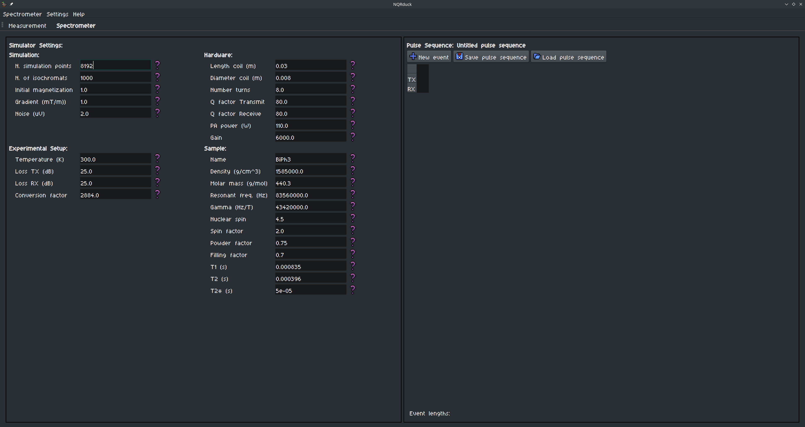
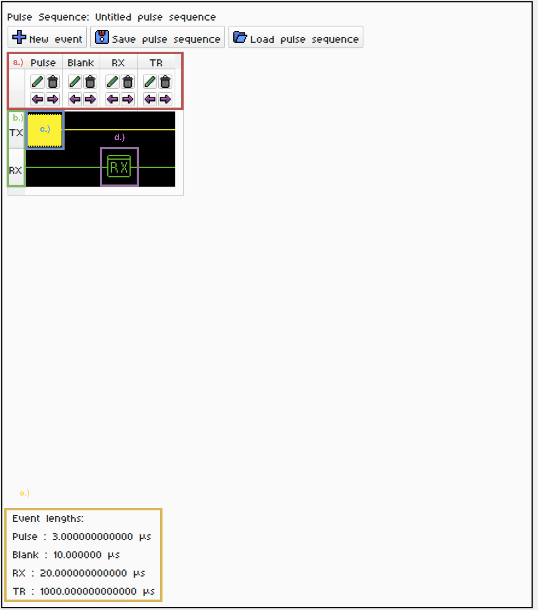

# 1. NQRduck Simulator Tutorial 🦆
## Introduction
This Tutorial gives a short overview of how to use the NQRduck Simulator. The NQRduck Simulator is a module of the NQRduck program that allows you to simulate NQR signals and spectra.

## Requirements
* All requirements from the [NQRduck Setup Tutorial](0_NQRduck_Setup.md)

## Steps (Linux)
1. Switch to the Spectrometer module in the NQRduck program.

|  |
| :--: |
| Figure: The `Spectrometer` module.  The `Settings` are on the left side and the `Pulse Programmer` on the right side.|

2. You can now see two different sections in the Spectrometer module:
    - The left side are the spectrometer `Settings`. These are values that don't  change during a `Pulse Sequence`.
    - The right side is the `Pulse Programmer`. Here you can create sequences of pulses that are executed during the simulation.

3. Create a simple Free Induction Decay (FID) sequence in the `Pulse Programmer` on the right side:
    - A sequence is made up of different `Events` that are executed subsequently. Different `Events` are rows in the `Pulse Programmer` table. 
    - For every `Event` you can specify a certain duration and a name. 
    - Every `Event` now has `Pulse Parameters` associated with it. For the Simulator, these are the TX and the RX Pulse Parameters.

|  |
|:-------------------------------------------------------------:|
| **Figure:** An exemplary FID sequence.                        |
| Description |
| **a.) The different events:** **Pulse:** Our TX Pulse excites the sample and is set active by adjusting the relative TX Amplitude to a value larger than 0 (usually 1.0). **Blank:** Waiting time between the TX Pulse and RX Readout to await coil ringing. **RX:** The ADC Readout that measures the signal. Without an RX event, the whole simulation appears in the plot. **TR:** The repetition time between the different averages. Not strictly necessary for the simulation right now. |
| **b.)** The Pulse Parameters for the selected event. |
| **c.)** The Pulse Parameters for the Pulse Event. |
| **d.)** The Pulse Parameters for the RX Event. |
| **e.)** The duration of the different events. |

You can add new `Events` by clicking on the `New Event` button. `Events` can be moved by clicking the purple Arrows. You can delete an `Event` by clicking on the garbage can icon. The `Event` duration and name can be changed.

Advisable durations for the different events are:
- **Pulse:** 3µs - Relative TX Amplitude: 1.0
- **Blank:** 8µs
- **RX:** 150µs
- **TR:** 10ms (not strictly necessary for the simulation, be careful since this will also 'use up' your simulation points.)

4. You can now adjust the settings  of the Simulator on the right side. Different settings are for example the number of simulation points or the noise level.

5. To start the simulation, switch back to the `Measurement` tab. Enter a `Target Frequency` of 83.56MHz and 100 `Averages`. Now press the `Start Measurement` button.

6. You should see an exponential decay in the plot. This is the FID signal that you just simulated.
 - The signal might look weird if you didn't set the correct Pulse Parameters. Try to adjust either the length of your TX event or the pulse power to achieve a $\frac{\pi}{2}$ flip angle.
 If your resolution looks low, try adjusting the number of simulation points in the `Settings` tab.

 7. Try setting the experiment temperature to 77K and see how the signal changes.

 9. Save your pulse sequence by clicking on the `Save pulse sequence` button in the Pulse Programmer.

 8. Next try to implement a Spin Echo (SE) sequence. Try to center your RX event around the echo of the signal. Play around with relaxation times and see how the signal changes.

10. If you found a pulse sequence that you like, you can save it by clicking on the `Save pulse sequence` button in the Pulse Programmer.

11. We will now run these sequences on the real hardware. See [Tutorial 2](2_LimeNQR.md) for more information.

## Notes:
- With some of the last updates I broke the signal processing options. I will fix this in the next updates. For now, you can only simulate the signal and not process it.

- The `Measurement Frequency` doesn't have any effect on the simulation right now. It is only used for the real hardware.

<!-- TODO:
Screenshot of the pulse programmer with a simple FID sequence
-->