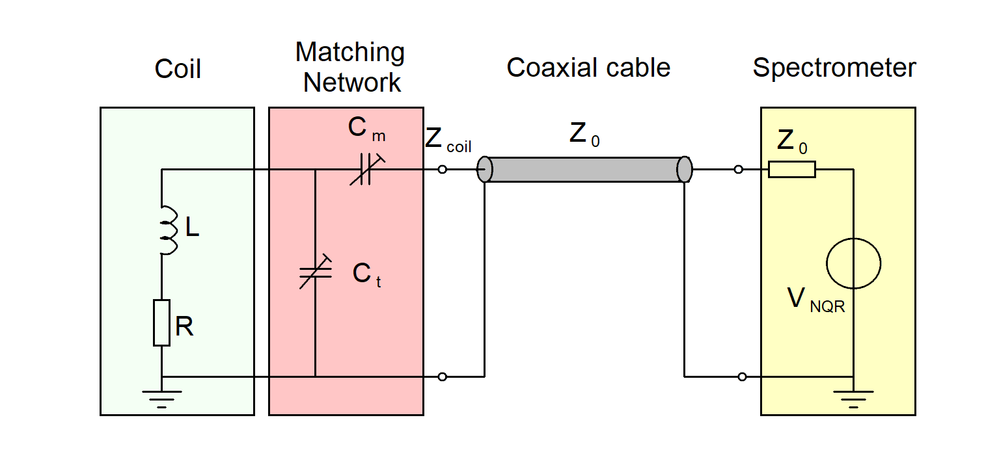
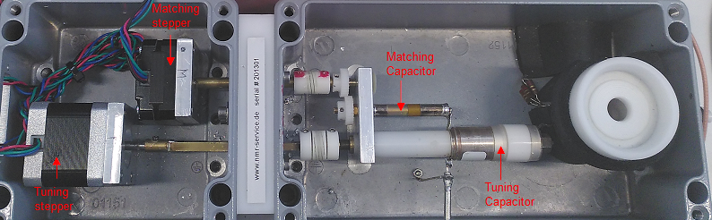
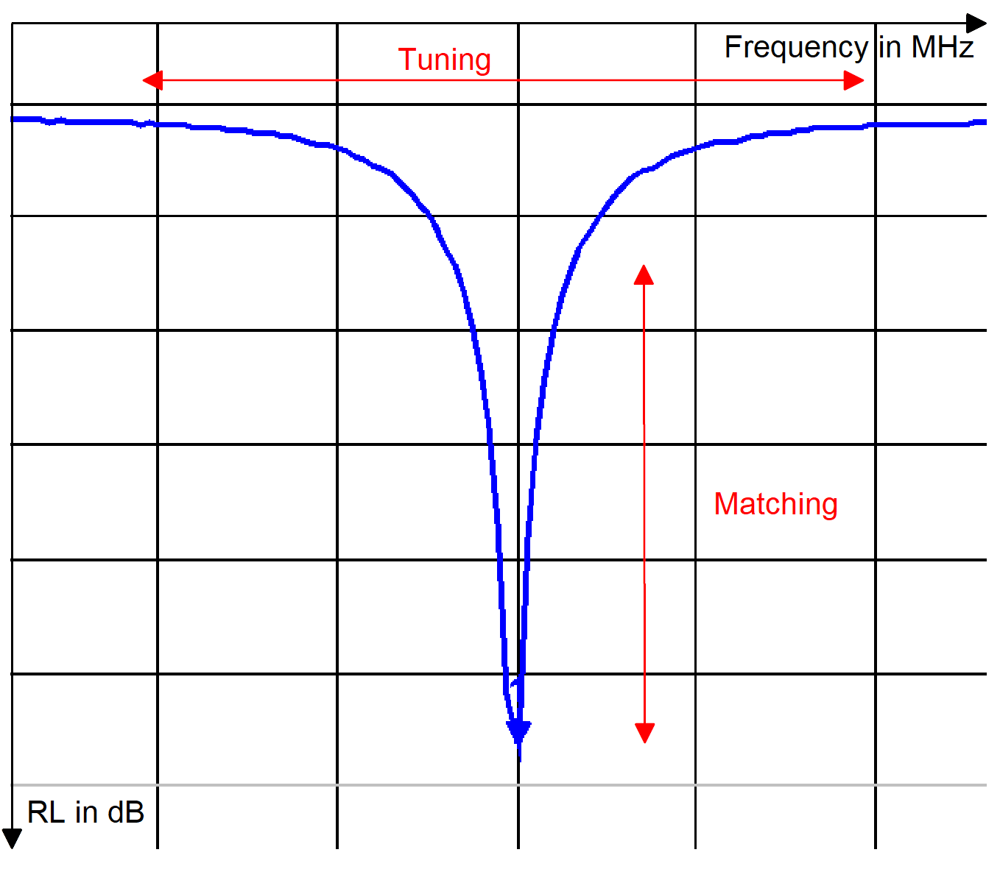
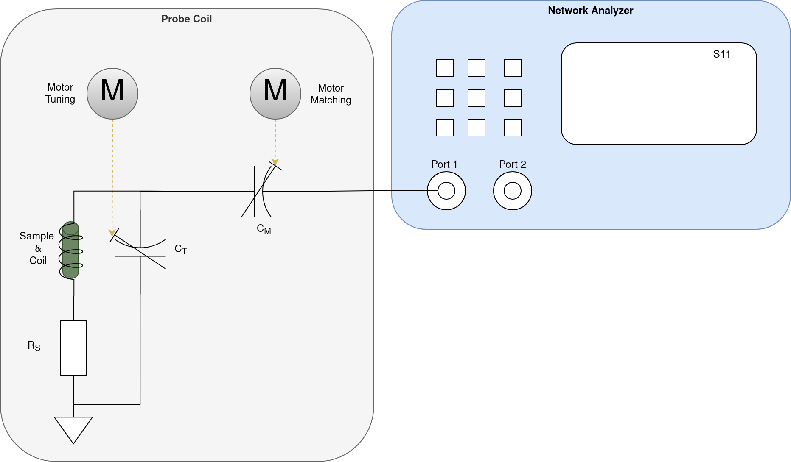
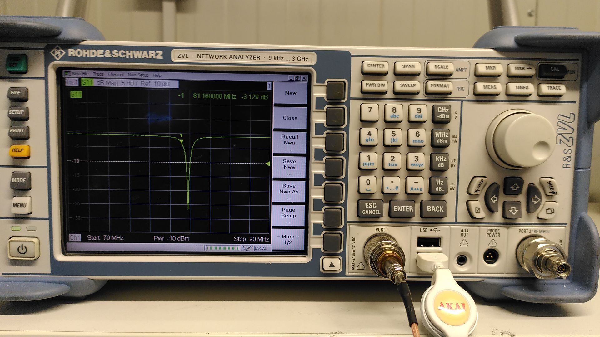
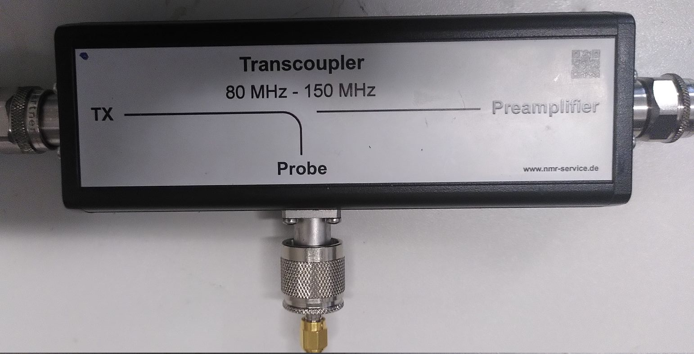
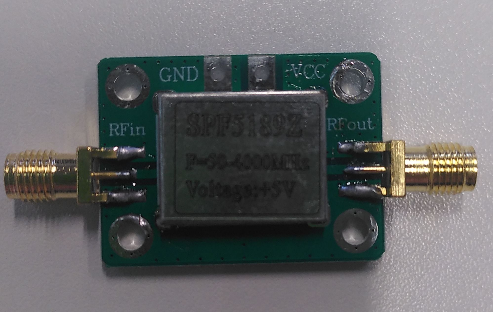
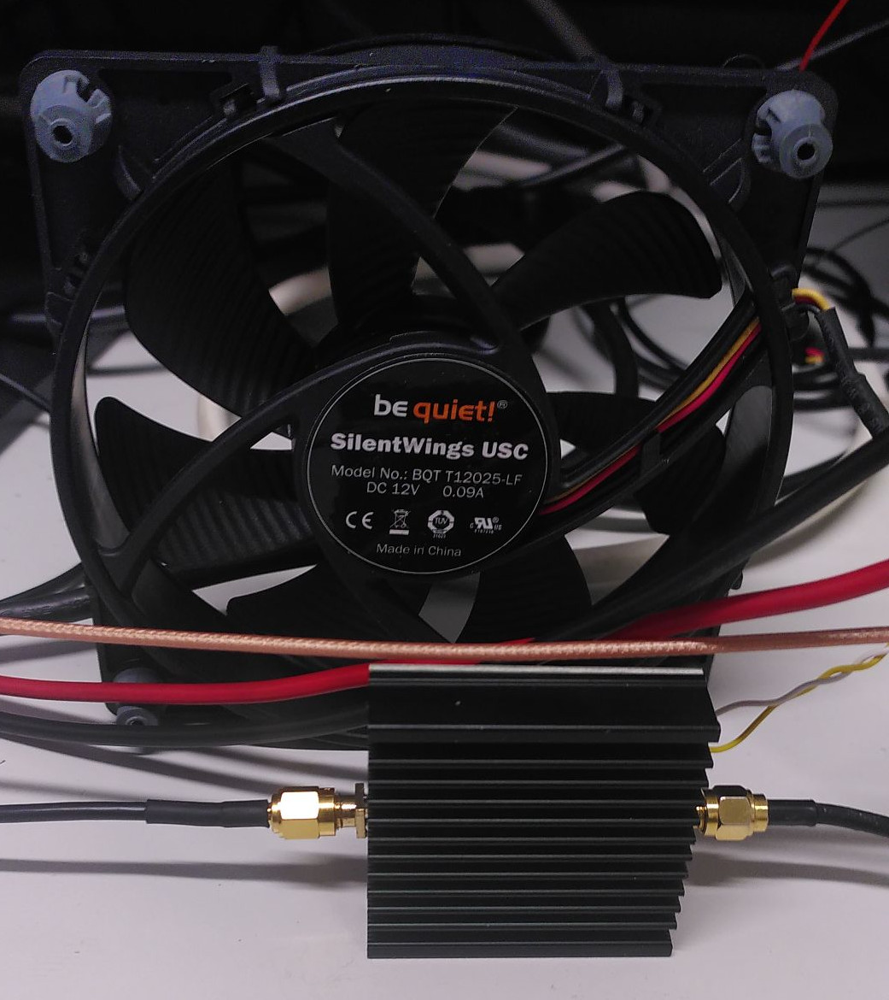
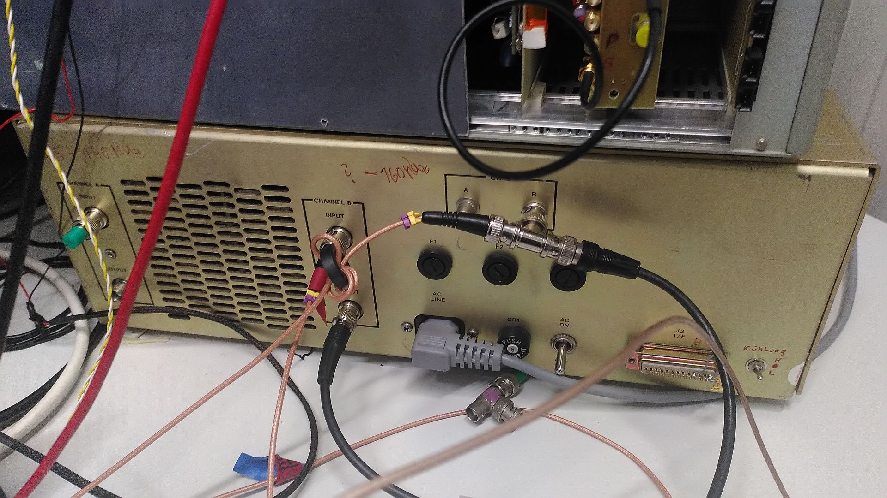
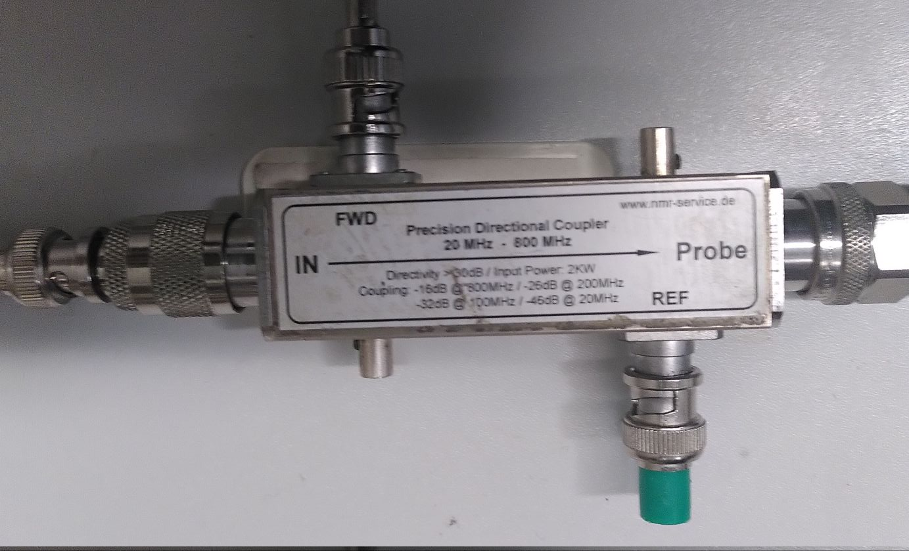

# 2. LimeNQR Tutorial 🦆
## Introduction
The LimeNQR spectrometer can be used with the NQRduck program for magnetic resonance experiments.

This tutorial will show you how to use the LimeNQR spectrometer with the NQRduck program. We will perform a loopback measurement, a TX check, and a NQR measurement on a sample. 

## Requirements
- All requirements from the [NQRduck Setup Tutorial](0_NQRduck_Setup.md)

- On Debian-based systems, the following packages are required to build the software:

    ```
    sudo apt-get install g++ cmake liblimesuite-dev libhdf5-dev
    ```

    On Arch Linux, the following packages are required to build the software:

    ```
    sudo pacman -S gcc cmake limesuite hdf5
    ```
- Last but not least, install the [nqrduck-spectrometer-limenqr](https://github.com/nqrduck/nqrduck-spectrometer-limenqr) module:

    ```
    pip install "nqrduck-spectrometer-limenqr @ git+https://github.com/nqrduck/nqrduck-spectrometer-limenqr"
    ```

## Steps (Linux)
### Loopback Measurement
This is a simple test to check if the LimeNQR spectrometer is working correctly. We measure the output signal of the LimeNQR spectrometer with the receive path of the LimeNQR spectrometer.

|  |
|:--:| 
| Figure: Schematic for the loopback measurement.|

1. Check that you installed the nqrduck-spectrometer-limenqr module. You can click on the `Spectrometer` button in the menu bar and select `LimeNQR`. Another way to check if the module is installed is to open `Help" -> About Modules`.

2. Connect the USB cable of the LimeNQR spectrometer to your computer. 

3. Load the FID pulse sequence into the `Pulse Programmer`. You can use the same sequence as in the [NQRduck Simulator Tutorial](1_Simulator.md).

4. Adjust the RX event to occur at the same time as the TX Pulse. We will perform a "Loopback" measurement, where we observe the output signal of of the LImeNQR spectrometer.

5. Connect the TX and RX ports of the LimeNQR spectrometer with a SMA cable and a 20dB attenuator.

|  |
|:--:| 
| Figure: Picture of the Spectrometer setup for the loopback measurement. The silver part is the attenuator. The RX and TX path are connected.|

6. Go to the measurement module, enter a `Target Frequency` and a number of `Averages` (100) and  click `Start Measurement`. You should be able to see the output signal of the LimeNQR spectrometer.

7. You can now change the pulse shape of the TX pulse and observe the signal change in the measurement module after running the measurement again.

8. You can also observe the signal in frequency space by clicking on the `FFT` button in the measurement module.

### TX Check
Here we will perform a test if the Radio Frequency Power Amplifier (RFPA) is working correctly. We will measure the output signal of the RFPA by pulsing into a 50 Ohm dummy load and observing the signal with an oscilloscope. 

|  |
|:--:|
| Figure: Picture of the dummy load.|

1. Load the FID pulse sequence in the `Pulse Programmer`. You can use the same sequence as in the [NQRduck Simulator Tutorial](1_Simulator.md). Make sure to add an TR event to the sequence. The last event in your pulse sequence will always be interpreted as the TR time. If you don't add a TR event, the duty cycle of the TX pulse might be too high and you could damage things. 

2. We use a pre-amplifier to amplify the signal of the LimeNQR spectrometer. Connect the TX port of the LimeNQR spectrometer to the Pre Amplifier. Connect the Pre Amplifier to the 12V Power Supply. Make sure the Pre Amplifier is cooled because it will burn out otherwise. The RX port of the LimeNQR spectrometer can stay unconnected. 

3. Connect the gate of the LimeNQR to the oscilloscope on Channel 1. Trigger on a rising flank on Channel 1. Use a timescale that makes sense for your pulse sequence.

4. Observe the pulse on Channel 2 of the oscilloscope, by connecting it to the Directional Coupler (FWD). Use AC coupling. 

5. Go to the spectrometer `Settings` and set the `TX gain` to `10`.

6. Set the `Target Frequency` to 83.56 MHz and the number of `Averages` to 100. Click `Start Measurement`. You should see the pulse on the oscilloscope. The blue trace is the Gate Signal and the yellow trace is the TX pulse.

### NQR Measurement
We will now perform a NQR measurement on a sample. We will use the BiPh3 sample for this tutorial.

|  |
|:--:|
| Figure: Picture of the BiPh3 sample. |

1. Load the NQR pulse sequence in the `Pulse Programmer` by clicking the `Load pulse sequence`. You can use the same sequence as in the NQRduck Simulator Tutorial. Make sure not to use the Loopback measurement where the RX event occurs at the same time as the TX pulse.

2. Put the sample into the probe coil and tune and match it at 83.56 MHz using a Network Analyzer. You can find detailed instructions at [Tuning and Matching](###Tuning-and-Matching).

3. Connections ⚡: 

The experiment now has to be set up as follows:

|  |
|:--:|
| Figure: Schematic of the NQR measurement setup. The power connections are not depicted. |

- [ ] Connect the 12V Power Supply to the LimeNQR spectrometer and the USB cable to your computer.
- [ ] Connect the Gate of the LimeNQR spectrometer to the Gate of the Power Amplifier.
- [ ] Connect the TX port of the LimeNQR spectrometer to the Pre Amplifier.
- [ ] Connect the Pre Amplifier to the 12V Power Supply. Maker sure the Pre Amplifier is cooled because it will burn out otherwise.
- [ ] Connect the RX port of the LimeNQR spectrometer to Low Noise Amplifier (LNA).
- [ ] Connect the LNA to the 5V Power Supply.

|  |
|:--:|
| Figure: Picture of the NQR measurement setup. |

4. Go to the measurement module, enter a `Target Frequency` of 83.56 MHz and a number of `Averages` (1000) and  click `Start Measurement`. You should be able to see the NQR signal of the BiPh3 sample. Don't pulse at any other frequency than 83.56 MHz, because you could damage the setup.

5. You should see a peak from your signal at the Intermediate Frequency (IF) that was set in the `Spectrometer` tab. The default value is 5MHz. 

-  What else do you see in the spectrum? Can you identify the different peaks?

6. To make sure that the signal is coming from the sample, you can remove the sample from the probe coil and see if the signal disappears.
⚠️CAREFUL!⚠️ You need to tune and match the probe coil again after removing the sample.

7. You can now also try a Spin Echo if the FID worked. If you have very long sequences, make sure to increase the `Acquisition Time` in the `Spectrometer` settings.

### Safety Tips ⚠️
- Don't leave the low noise amplifier (LNA) unconnected on the in- and output. This could damage the LNA.

- Don't output a pulse without a load connected to the TX port. This could damage the RFPA.

- Don't pulse at any other where the probe coil is not tuned and matched. This could damage the setup.

- Don't forget the TR event in your pulse sequence. This could damage the setup.

- Make sure the Pre Amplifier is cooled. It will burn out otherwise.

## Additional Information

### Tuning and Matching
_Tuning and Matching_ describes the process of adjusting the probe coil to the Larmor frequency of the sample.

#### Theory

At high frequencies the impedance of the coil has to be matched to the characteristic impedance of the cables and spectrometer of 50 $\Omega$. If we don't match the impedance, the signal will be reflected at the coil and we will lose signal strength.

|  |
|:--:| 
|Figure: Example of a parallel resonator topology. The coaxial cable and output of the spectrometer are matched to a purely resistive impedance $Z_0$ of $50\Omega$. The Matching Network matches the impedance of the coil to $50\Omega$ to minimize reflections.|

The reflection coefficient $\Gamma$ describes what portion of the forwarded signal is reflected. It can be calculated from the impedance of the probe coil $Z_{coil}$ and the characteristic impedance of the cable $Z_0$.

$
    \Gamma = \frac{Z_{coil} - Z_0}{Z_{coil} + Z_0}
$

As can be seen, the reflection of the forward running signal is minimal when $Z_{coil}$ is equal to $Z_{0}$.

The reflection coefficient can can also be expressed in terms of the Return Loss $RL$ in dB:

$
    RL = -20 \cdot \log_{10}(|\Gamma|)
$

We therefore want to achieve a high Return Loss to minimize reflections.

#### Tuning and Matching in Practice

For Tuning and Matching the coil has two adjustable capacitors. One for tuning and one for matching of the probe coil:

|  |
|:--:|
| Figure: Picture of the probe coil with the steppers. The stepper/capacitor for tuning and matching are labelled.|

While the probe coil has stepper motors for automatic Tuning and Matching of the probe coil, we will use our hands to adjust the capacitors. Don't worry, the stepper motors can be moved by hand without damaging them.

The principle of tuning and matching is shown in the following figure:

|  |
|:--:|
| Figure:Depiction of a reflection measurement of our probe coil. On the x-axis you can see the frequency and on the y-axis the $RL$. In a simplified viewpoint, $C_t$ can be used to adjust the resonance frequency (Tuning) of the probe coil, and $C_m$ for the amount of reflection (Matching) occurring at resonance frequency. While tuning and matching influence each other in real applications, this representation can be helpful in understanding the functions of the capacitors for tuning and matching. |

We use a Vector Network Analyzer (VNA) to measure the $S_{11}$ value of our probe coil. The $S_{11}$ value is directly related to the Return Loss $RL$: In a simplified view only the sign is inverted.

Connect the SMA port of the probe coil to Port 1 of the VNA and start a $S_{11}$ measurement:

|  |
|:--:|
| Figure: Schematic of the VNA measurement setup. The probe coil is connected to Port 1 of the VNA.|

Now create a marker by clicking the `MKR` button and move it to 83.56 MHz, which is the Larmor Frequency of our BiPh3 sample. You can now adjust the capacitors of the probe coil to achieve a minimum $S_{11}$ value at 83.56 MHz (about -30dB). By narrowing the frequency range of the VNA you can increase the resolution of the measurement.

|  |
|:--:|
| Figure: Picture of the VNA performing a $S_{11}$ measurement. Port 1 of the VNA is directly connected to our probe coil. The VNA has a button `SPAN` that can be used to adjust the frequency range of the measurement. To scale the RL measurement you can click the `SCALE` button and select `Autoscale`.|

Make sure you perform the Tuning and matching with your sample in the probe coil. The sample influences the resonance frequency of the probe coil.

### Transcoupler
The Transcoupler is used as a passive TX-RX switch. 

|  |
|:--:|
| Figure: Picture of the Transcoupler.

It has three different connections:
- TX: Which is usually connected to the OUT port of the Directional Coupler.
- Probe: Which is usually connected to the Probe Coil.
- Preamplifier: Which is usually connected to the LNA. 

### Low Noise Amplifier (LNA)
The LNA is used to amplify the NQR signal before it is digitized by the LimeNQR spectrometer.

|  |
|:--:|
| Figure: Picture of the LNA.|

It needs a 5V power supply and the input and output are marked on the PCB.

The input is usually connected to the Preamplifier Port of the Transcoupler and the output to the RX port of the LimeNQR spectrometer.

### Pre Amplifier
The Pre Amplifier is used to amplify the TX signal before it is sent to the RFPA. Always cool the Pre Amplifier, because it will burn out otherwise.

|  |
|:--:|
| Figure: Picture of the Pre Amplifier and the cooling fan. Both need 12V. The input and output side are marked on the backside.|

The Pre Amplifier needs a 12V power supply.

### Radio Frequency Power Amplifier (RFPA)
The RFPA is used to amplify the TX signal before it is sent to the probe coil.
It has 3 connections:

|  |
|:--:|
| Figure: Picture of the RFPA.|

It has a Gate input that is used to switch the RFPA on and off. The Gate signal is generated by the LimeNQR spectrometer and is connected to the Gate Port of the spectrometer. Additionally use a splitter on the Gate Port of the RFPA to observe the gate signal on the oscilloscope (see picture).

Additionally it has an input for the RF signal it should amplify. Usually this is connected to the Pre Amplifier.

The RFPA has an output that is usually connected to the input of the directional coupler. 

#### Notes:
Use Channel B of the RFPA. Right now Channel A is not working.

### Directional Coupler
The directional coupler decouples a part of the TX signal. This way we can observe the TX signal on the oscilloscope.

|  |
|:--:|
| Figure: Picture of the Directional Coupler.|

The directional coupler is used to observe the TX signal on the oscilloscope. The `FWD` port of the directional coupler is usually connected to the oscilloscope. You need to add a splitter to the oscilloscope Channel and terminate it with a 50 Ohm terminator.

The `IN` port is usually connected to the output of the RFPA.

The `Probe` port is usually connected to the `TX`port of the Transcoupler.


