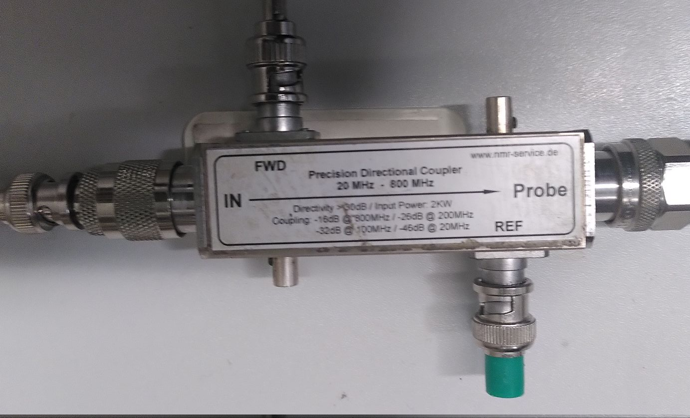

# Directional Coupler
The directional coupler decouples a part of the TX signal. This way we can observe the TX signal on the oscilloscope.

|  |
|:--:|
| Figure: Picture of the Directional Coupler.|

The directional coupler is used to observe the TX signal on the oscilloscope. The `FWD` port of the directional coupler is usually connected to the oscilloscope. You need to add a splitter to the oscilloscope Channel and terminate it with a 50 Ohm terminator.

The `IN` port is usually connected to the output of the RFPA.

The `Probe` port is usually connected to the `TX`port of the Transcoupler.