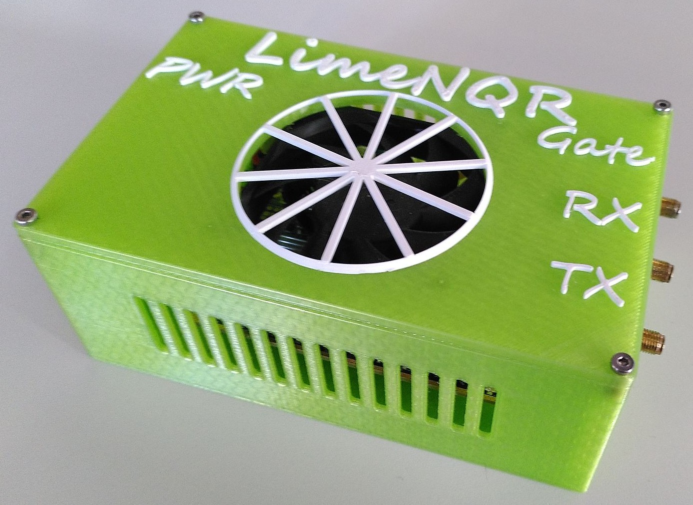

# LimeNQR

|  |
|:--:|
| Figure: Picture of the LimeNQR spectrometer.|

## Connections

The LimeNQR has 5 different connections:
- **Gate**: This is the connection to the Gate of the Power Amplifier. It is used to turn the RFPA on and off. It's a SMA connection.
- **TX**: This is the connection to the Pre Amplifier. It is used to send the TX pulse to the probe coil. It's a SMA connection.
- **RX**: This is the connection to the Low Noise Amplifier (LNA). It is used to receive the signal from the probe coil. It's a SMA connection.
- **PWR**: This is the connection to the 12V Power Supply. It is used to power the LimeNQR. It's a 2.1mm DC Jack. You can do loopback measurements without the power supply, but you won't be able to read a Gate signal.
- **USB**: This is the connection to the computer. It is used to control the LimeNQR. It's male USB Type A connection (you need a female USB for connection).

## Notes
- The LimeNQR has a cooling fan that is turned on when the 12V Power Supply is connected.
- The LimeNQR has a gate signal that is enabled on when the 12V Power Supply is connected. However the gate signal stays low until you output a pulse. The gate signal is high during the pulse and low otherwise as specified in the spectrometer settings.
- Don't go higher than a sampling rate of 30.72 MHz. This makes the communication between the LimeNQR and the computer unstable.
- If you get an error when running measurements with the LimeNQR spectrometer, try another USB port. USB 3.0 ports are recommended. Also try to use a port that is directly connected to the motherboard.
