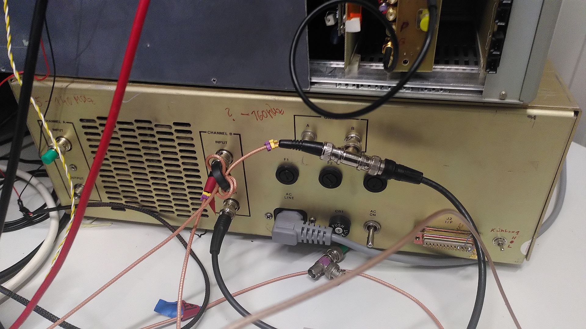

# Radio Frequency Power Amplifier (RFPA)
The RFPA is used to amplify the TX signal before it is sent to the probe coil.
It has 3 connections:

|  |
|:--:|
| Figure: Picture of the RFPA.|

It has a Gate input that is used to switch the RFPA on and off. The Gate signal is generated by the LimeNQR spectrometer and is connected to the Gate Port of the spectrometer. Additionally use a splitter on the Gate Port of the RFPA to observe the gate signal on the oscilloscope (see picture).

Additionally it has an input for the RF signal it should amplify. Usually this is connected to the Pre Amplifier.

The RFPA has an output that is usually connected to the input of the directional coupler. 

## Notes:
Use Channel B of the RFPA. Right now Channel A is not working